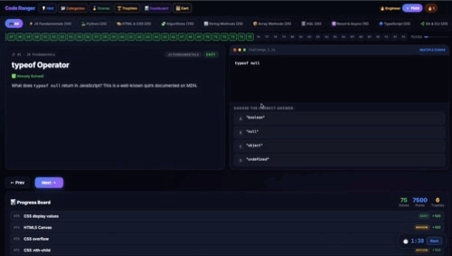

<p align="center">
  
</p>

A **795-challenge** coding game with an AI-powered Build Lab, Interview Lab, and a Developer's AI Toolbelt. Players progress through bite-sized challenges across **21 categories**, unlock a real coding workspace seeded with 8 production-style example builds, get AI-driven code review on their projects, and build a downloadable resume that auto-fills from the categories they've mastered. The whole experience is a single continuous flow — *play to learn, learn to build, build to ship*.

## 👤 Author
**Jacqueline**
[Check out my GitHub Profile](https://github.com/jdbostonbu-ops)
🚀 **[Try the Live App](https://dev-play-nine.vercel.app/)**

<p align="center">
  
</p>

## 🎓 Built During Next Chapter — Phase I

This project was designed and built during **Phase I & II Thinking with AI** at Next Chapter Apprenticeship. Each lesson fed directly into this build:

- **Computational Thinking** — Decomposing the project into Slices (backend → integration → voice grading → deployment), recognizing repeating patterns across 795 challenges, abstracting the AI provider into a swappable wrapper, and writing the unlock-gate logic as a clean algorithm.
- **AI Prompting** — Crafting system instructions that produce reliable structured output (interview grading format, code review with strengths/weaknesses), iterating on prompts until the AI's response matched the user experience. A dedicated 25-lesson **Developer's AI Toolbelt** category now teaches these same skills to players.
- **HTML / CSS / Forms** — Semantic landmark structure, accessible labels with `for` attributes throughout, mobile-first responsive layouts, and elaborate CSS animations. The Resume Builder uses fully validated forms with live preview.
- **Debugging** — Tracing through `console.log`, reading Python tracebacks, identifying CORS preflight failures, hunting zombie processes holding ports, and translating cryptic errors into root causes.

The project demonstrates everything Phase II covered, deployed as a working full-stack app.

## 🌐 Browser & Device Compatibility

| Browser / Device | Status | Performance Notes |
| --- | --- | --- |
| **Google Chrome** | ✅ Tested | Full support — game flow, Build Lab editor, AI integration, Resume Builder. |
| **Microsoft Edge** | ✅ Tested | Matches Chrome rendering engine exactly. |
| **Firefox** | ✅ Tested | Full feature support including animations and AI calls. |
| **Apple Safari (macOS)** | ✅ Tested | All features functional including PDF export and Edit Resume window. |
| **iPhone (iOS Safari)** | ✅ Tested | Touch interactions, smooth scroll, and AI features fully functional. |
| **iPad / iPadOS** | ✅ Tested | Responsive grids adapt correctly to tablet viewports. |

## 🌟 Key Features

- **795 Sourced Challenges Across 21 Categories:** Web Basics (270), JS Fundamentals, Python, HTML & CSS, Algorithms, String Methods, Array Methods, SQL, React & Async, TypeScript, Git & CLI, Web Security, Node.js, Data Structures, Python Advanced, JS Advanced, CSS Advanced, HTTP & APIs, Testing — every challenge sourced from MDN, web.dev, W3Schools, LaunchCode curriculum, and official docs.
- **🛠️ Developer's AI Toolbelt — NEW:** A dedicated 25-lesson category teaching prompt engineering for developers, gated behind 50% Web Basics completion. Covers all 7 prompt types (Creative, Informational, Reasoning, Listicle, Instructional, Interactive, Keyword), do's and don'ts, and the IBM-sourced AI/Prompt Engineering distinction. Reinforces the principle that AI is a tool to *augment* coding skills, not replace them. Sourced from the Verizon × Next Street AI Prompting Worksheet.
- **Three Lesson Formats:** Multiple-choice, run-and-observe (live HTML/CSS/JS rendering), and code-completion. Every wrong answer becomes a learning moment via the hint drawer.
- **AI-Powered Build Lab:** A live coding workspace with HTML/CSS/JS/Python tabs, sandboxed iframe preview, and a "Get AI Feedback" button that sends your code through a Python backend to Google Gemini for personalized review.
- **8 Build Inspiration Examples:** Pre-built, fully working starter projects to remix and learn from — Animated Gradient Background, Rotating CSS Logo, Minimalist Landing Page, Interactive Counter Widget, Dog Walking Business Site, Memory Match Game, Magazine Landing Page, and **Mini Pac-Man** (full 19×21 maze game with a chase-AI ghost).
- **Interview Lab:** Five interview modes — Decode, Voice Explainer, Concept Q&A, Stack Interview, and AI Prompt Lab — with a 90-second timer that mirrors real interview conditions.
- **Live Resume Builder:** Fill in personal info, projects, and experience — the Technical Skills section auto-populates from categories the player has solved 80% or more of. Skills are grouped accurately on the resume: *Languages*, *Web Technologies* (HTML/CSS), *Frameworks & Libraries* (React/Node), *Tools*, *Security*, and *Concepts*.
- **3 Resume Export Options:**
  - **📄 Save as PDF** — opens a print-ready window that uses the browser's native print dialog (text-based, ATS-readable PDF)
  - **📋 Copy as Text** — clean ASCII to clipboard for LinkedIn, email, or any application form
  - **✏️ Edit Resume** — opens a new window with `contenteditable` enabled on every section for one-off tweaks, with Print/Copy/Select-All controls
- **Trophy & Achievement System:** 22 trophies that unlock at meaningful milestones — first win, 10 solved, 50 solved, category mastery, perfect streaks, the **AI Toolbelt Master** for completing all 25 AI Prompting lessons, and the **Champion** for solving all 795.
- **Performance Dashboard:** Visualizes per-category mastery, points, streak history, and unlock progress.
- **Daily Streak Tracking:** Returning players see streak fire counters that incentivize consistency.
- **Progress Persistence:** All progress saves to `localStorage` — no account required, no data leaves the device.
- **Accessible Forms Throughout:** Every label uses `for` attributes, every form supports keyboard navigation, every animation respects `@media (prefers-reduced-motion)`.

## 🔒 Privacy & Your Data | Optional BYOK (bring-your-own-key)

Code Ranger is designed to respect your privacy at every step.

- **No account, no signup.** You can play, build, and use the AI features without creating an account or sharing personal information.
- **Your progress stays on your device.** All game progress, trophies, and resume data are saved only in your browser's local storage. Clearing your browser data clears your progress — nothing lives on a server.
- **Your API key is yours alone.** If you choose to use your own Gemini API key, it's stored only in your browser. When you click "Get AI Feedback," your key is sent with that one request and immediately discarded by our server — it's never saved, logged, or shared with anyone.
- **No key? No problem.** A shared demo allowance lets you try the AI features without one. Daily limits keep usage fair for all visitors.
- **Server keys stay server-side.** The app's own API key (used for the demo allowance) is held only on the server and is never visible in your browser.

Code Ranger doesn't use cookies, doesn't track you, and doesn't have a database that stores anything about you.

## 🛠️ Tech Stack

- **Frontend:** Vanilla JavaScript (ES6+) — `IntersectionObserver`, `localStorage`, sandboxed iframes for code preview, dynamic DOM construction, closure-based state for the resume builder, Pac-Man canvas game with chase AI.
- **Styling:** CSS3 — Custom Properties, CSS Grid, Flexbox, gradients, `@keyframes` animations, custom `cubic-bezier` easing, `clamp()` for fluid typography, mobile-first responsive design. Separate dedicated print stylesheet (`resume-print.css`) loaded only by the resume export window.
- **Typography:** Inter, JetBrains Mono — Google Fonts.
- **Backend:** Python 3.11 — FastAPI, Uvicorn, Pydantic for request validation, `python-dotenv` for environment variables.
- **AI Integration:** Google Gemini (`gemini-2.5-flash`) via the official `google-generativeai` SDK, wrapped in a swappable abstraction so providers can be swapped without touching route handlers.
- **Resume Export:** Native browser APIs only — `window.open()` + `window.print()` for PDF, `navigator.clipboard` for text copy, `contenteditable` for the edit window. **Zero external JS libraries** for export — `html2pdf.js` and `docx` were removed for a ~650 KB page weight reduction.
- **Deployment:** Vercel — frontend served as static assets, backend deployed as a Python serverless function under `/api/*`. Environment variables set via Vercel dashboard. Auto-deploy on every push to `main`.

## 🚀 The User Flow

- **Land on the start screen** → see the 795-challenge stat callout, Interview Lab teaser, and category picker.
- **Pick a category and click START** → enter the game UI with the challenge panel, code panel, hint drawer, and live progress board.
- **Solve challenges** → multiple-choice, code-completion, or run-and-observe lessons with instant feedback and trophy unlocks at milestones.
- **Unlock Interview Lab at 5 wins** → practice with five interview modes under a real 90-second timer.
- **Unlock Build Lab at 75 wins** → enter a coding workspace with file tabs, live preview, and AI code review. 8 Build Inspiration examples ready to remix.
- **Click "Get AI Feedback" in Build Lab** → your code is sent through the Python backend to Gemini, which returns structured feedback (what's working, what to improve, what to learn next).
- **Reach 50% Web Basics completion** → unlock the 🛠️ **Developer's AI Toolbelt** with 25 lessons on prompt engineering.
- **Build your resume below** → fill in personal info, projects, experience; Technical Skills auto-fills from category mastery; export as PDF, copy as text, or open in an editable window.

## 🔐 Backend Architecture

```
Browser
  ↓ POST /api/chat  { prompt, optional user_api_key }
Vercel Edge
  ↓ routed to Python serverless function
FastAPI handler
  ↓ checks daily rate limit per IP
  ↓ resolves which API key to use (user's BYOK or server's protected key)
Google Gemini
  ↓ generates response
Back through the function
  ↓ JSON response with content + remaining quota
Browser displays result inline
```

The user's API key (if provided) flows through the request body and is **never stored** server-side. The server's demo key is loaded from environment variables, never committed, and never sent to the browser.

## 🎓 Future Vision

- **Slice 3 — Interview Voice Grading:** Add Web Speech API transcription to the Interview Lab; send transcripts to the existing `/api/grade-interview` endpoint for structured AI feedback (score, strengths, weaknesses, model answer).
- **Monaco Editor in Build Lab:** Replace the textarea with the same editor that powers VS Code for syntax highlighting, autocomplete, and IntelliSense.
- **More Toolbelt Categories:** Beyond AI Prompting, add "Developer's Git Toolbelt," "Developer's Testing Toolbelt," "Developer's Deployment Toolbelt" — same metaphor scaled to additional career skills.
- **GitHub Integration:** Push Build Lab projects directly to a user's GitHub repo with auto-generated READMEs.
- **Subscription Tier:** Optional paid tier for unlimited AI calls without BYOK.
- **More Categories:** Rust, Go, Kubernetes, system design challenges.
- **Streak Recovery:** Allow streak protection via a one-time-per-week "rest day" mechanic.

## 🧰 Run It Locally

If you want to run a local copy for development:

```bash
# Clone the repo
git clone https://github.com/jdbostonbu-ops/Dev-Play.git
cd Dev-Play

# Create Python virtual environment
python3.11 -m venv venv
source venv/bin/activate      # Mac/Linux
# venv\Scripts\Activate.ps1   # Windows

# Install dependencies
pip install -r requirements.txt

# Create your .env from the template
cp .env.example .env
# Then open .env and add your free Gemini key from https://aistudio.google.com/apikey

# Run the backend
uvicorn api.index:app --reload --port 3001

# In a separate terminal, serve the frontend
# (use VS Code Live Server, or any static server)

# If lesson 533 (Audio Player) is part of your testing flow, place
# the local MP3 file at: audio/latin-guitar.mp3
```

## 📐 Code Conventions

Code Ranger follows strict conventions throughout the codebase:

- **`let`, never `var`** — modern block-scoped declarations only.
- **`<label for="id">` on every form input** — accessibility-first markup.
- **`textContent`, never `innerHTML`, for user-provided strings** — XSS-safe rendering.
- **Closure-based functions for stateful logic** — the resume builder, Pac-Man, Memory Match, and Build Lab all use private state via closure rather than globals.
- **No inline CSS** — every style lives in `style.css` or `resume-print.css`.
- **Cited sources on every lesson** — MDN, web.dev, W3Schools, LaunchCode, IBM, and the Verizon × Next Street AI Prompting Worksheet for the AI Toolbelt content.

## 🎓 Phase I

Code Ranger is what I built during Phase I of Thinking with AI — a single continuous experience that takes a learner from their first challenge to a published portfolio resume, with a real Python backend and a real AI integration in between.

⭐ Love this project? Give it a star and explore the other deployed projects in this portfolio.

<p align="center">
  
</p>
